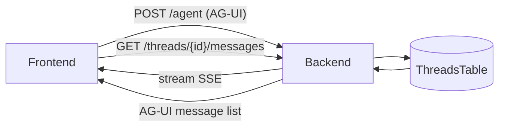

# CopilotKit + Pydantic AI Message Persistence

## Scope
Use this skill to implement persistent, thread-based chat history with:
- CopilotKit v1.50 frontend (`CopilotChat` v2)
- Pydantic AI backend using AG-UI
- Database-backed message storage (Pydantic AI `ModelMessage` format)

## Data flow (high level)


## Quick start checklist
- [ ] Frontend uses `CopilotChat` from `@copilotkit/react-core/v2`
- [ ] Thread switching uses `useThreads().setThreadId(threadId)`
- [ ] Frontend loads history from backend and calls `useCopilotChatInternal().setMessages(...)`
- [ ] Backend exposes `POST /agent` (AG-UI run) and `GET /threads/{id}/messages` (history)
- [ ] Backend stores Pydantic AI messages via `ModelMessagesTypeAdapter.dump_json(...)`
- [ ] Backend stores full snapshot state per thread

## Frontend wiring (CopilotKit v1.50)

### Required hooks
- `useThreads()` for thread switching
- `useCopilotChatInternal()` for programmatic `setMessages(...)`

### Thread switching rules
- The UI must call `setThreadId(threadId)` when the user selects a thread.
- Use a stable `threadId` string from your database (not a random UUID per refresh).
- When the thread changes, reload history and overwrite the chat message list.

### Example
```tsx
import { useThreads, useCopilotChatInternal } from "@copilotkit/react-core";
import { CopilotChat } from "@copilotkit/react-core/v2";

const { setThreadId } = useThreads();
const { setMessages } = useCopilotChatInternal();

useEffect(() => {
  setThreadId(activeThreadId);
}, [activeThreadId, setThreadId]);

useEffect(() => {
  const loadHistory = async () => {
    const res = await fetch(`/threads/${activeThreadId}/messages`);
    const aguiMessages = await res.json(); // array of AG-UI messages
    setMessages(aguiMessages);
  };
  loadHistory();
}, [activeThreadId, setMessages]);

return <CopilotChat threadId={activeThreadId} />;
```

### Styling (v2 UI)
```ts
import "@copilotkit/react-ui/v2/styles.css";
```

### History loading contract
The backend should return an array of AG-UI messages shaped like:
```json
[
  { "id": "thread-1-history-0", "role": "user", "content": "Add a proverb about time." },
  { "id": "thread-1-history-1", "role": "assistant", "content": "Added: A stitch in time saves nine." }
]
```
Pass this array directly to `setMessages(...)`.

## Backend wiring (Pydantic AI + AG-UI)

### Required endpoints
- `POST /agent`: handle AG-UI requests and stream responses
- `GET /threads/{id}/messages`: return AG-UI messages for UI history
- Optional: `GET /threads` to list thread metadata

### AG-UI request shape (minimum)
```json
{
  "threadId": "thread-1",
  "runId": "run-abc",
  "messages": [
    { "id": "msg-1", "role": "user", "content": "Hello" }
  ],
  "tools": [],
  "context": [],
  "state": {}
}
```

### Storage format (database)
Store **Pydantic AI `ModelMessage` list** per thread:
- `messages_json` = `ModelMessagesTypeAdapter.dump_json(messages)`
- `state_json` = full snapshot (e.g. `deps.state.model_dump()`)

### Message storage lifecycle
1. Convert incoming AG-UI messages to Pydantic AI messages.
2. Merge with stored `ModelMessage` list.
3. Run agent with `message_history=merged_messages`.
4. Persist `result.all_messages()` and full snapshot state.

### Message conversion
Incoming AG-UI messages → Pydantic AI:
```py
from pydantic_ai.ui.ag_ui._adapter import AGUIAdapter

incoming_messages = AGUIAdapter.load_messages(run_input.messages)
```

Stored Pydantic AI messages → AG-UI for UI history:
```py
from pydantic_ai.messages import ModelRequest, ModelResponse, UserPromptPart

def model_messages_to_agui(messages: list[ModelMessage], thread_id: str) -> list[dict]:
    out = []
    for i, msg in enumerate(messages):
        msg_id = f"{thread_id}-history-{i}"
        if isinstance(msg, ModelRequest):
            for part in msg.parts:
                if isinstance(part, UserPromptPart):
                    out.append({"id": msg_id, "role": "user", "content": part.content})
                    break
        elif isinstance(msg, ModelResponse):
            if msg.text:
                out.append({"id": msg_id, "role": "assistant", "content": msg.text})
    return out
```

### Deduping message history
AG-UI messages include unique `id` values. Track processed IDs per thread to avoid re-appending:
```py
if agui_message.id in known_ids:
    continue
known_ids.add(agui_message.id)
```
Store `known_ids` in DB or derive from `messages_json` if you encode source IDs in metadata.

### AG-UI run handler (database version)
```py
from ag_ui.core import RunAgentInput
from pydantic_ai.ag_ui import run_ag_ui, SSE_CONTENT_TYPE
from pydantic_ai.messages import ModelMessagesTypeAdapter

@app.post("/agent")
async def ag_ui_endpoint(request: Request):
    run_input = RunAgentInput.model_validate_json(await request.body())
    thread_id = run_input.thread_id

    # 1) Load stored state + messages from DB
    row = db.get_thread(thread_id)
    stored_messages = ModelMessagesTypeAdapter.validate_json(row.messages_json)
    stored_state = json.loads(row.state_json)

    # 2) Convert incoming AG-UI messages and merge
    incoming_messages = AGUIAdapter.load_messages(run_input.messages)
    message_history = [*stored_messages, *incoming_messages]

    # 3) Run with full snapshot state
    deps = StateDeps(StateModel.model_validate(stored_state))

    def on_complete(result):
        db.save_thread(
            thread_id,
            messages_json=ModelMessagesTypeAdapter.dump_json(result.all_messages()),
            state_json=json.dumps(deps.state.model_dump()),
        )

    accept = request.headers.get("accept", SSE_CONTENT_TYPE)
    return StreamingResponse(
        run_ag_ui(
            agent,
            run_input.model_copy(update={"messages": run_input.messages}),
            accept=accept,
            message_history=message_history,
            deps=deps,
            on_complete=on_complete,
        ),
        media_type=accept,
    )
```

### SSE response requirements
- Return `media_type=accept` (usually `text/event-stream`)
- Ensure proxy/server does not buffer the response
- For Nginx, disable buffering for the `/agent` route

## Database schema (example)
```
threads(
  thread_id TEXT PRIMARY KEY,
  title TEXT,
  messages_json BLOB/TEXT,  -- ModelMessagesTypeAdapter JSON
  state_json TEXT,          -- full snapshot
  updated_at TIMESTAMP
)
```

### Migration notes
If starting from in-memory storage:
1. Add table and migrate existing threads.
2. Backfill `messages_json` using `ModelMessagesTypeAdapter.dump_json(...)`.
3. Backfill `state_json` as full snapshot.
4. Switch reads/writes to DB.

## API reference (suggested)
### `GET /threads`
Returns thread list for UI:
```json
[
  { "thread_id": "thread-1", "title": "Proverbs A", "message_count": 2 },
  { "thread_id": "thread-2", "title": "Proverbs B", "message_count": 5 }
]
```

### `GET /threads/{id}/messages`
Returns AG-UI messages to preload chat history.

### `POST /agent`
Accepts AG-UI `RunAgentInput`, streams AG-UI events.

## Operational guidance
### Logging
Log these per request:
- `thread_id`, number of incoming messages
- number of stored messages after save
- size of state snapshot

### Error handling
- If thread not found on `/threads/{id}/messages`, return `[]`
- If `messages_json` is invalid, return 500 and log the raw payload

### CORS
Allow your frontend origin to call `/threads/*` and `/agent`.

### Security
- Validate `threadId` ownership if you have auth.
- Avoid returning threads not owned by the user.

## Common pitfalls
- **No history in UI**: `CopilotChat` does not auto-load history. You must call `setMessages(...)`.
- **Thread switch doesn’t update agent**: call `setThreadId(threadId)` from `useThreads()`.
- **Wrong styles**: use `@copilotkit/react-ui/v2/styles.css`.
- **Losing state**: always persist the full snapshot, not deltas.
- **Duplicate messages**: ensure AG-UI message IDs are deduped before conversion.

## Sources
- Cursor Skills format: https://cursor.com/docs/context/skills
- CopilotKit v1.50 release notes: https://docs.copilotkit.ai/whats-new/v1-50
- Pydantic AI docs: https://ai.pydantic.dev/
- AG-UI docs: https://docs.ag-ui.com/
